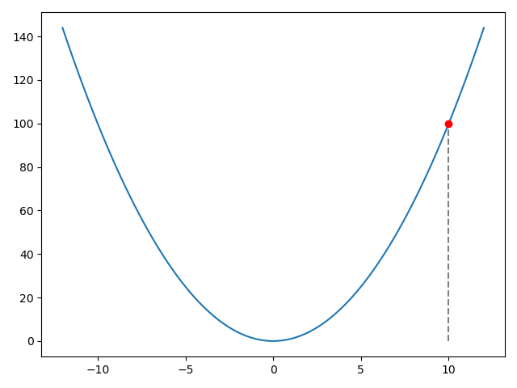
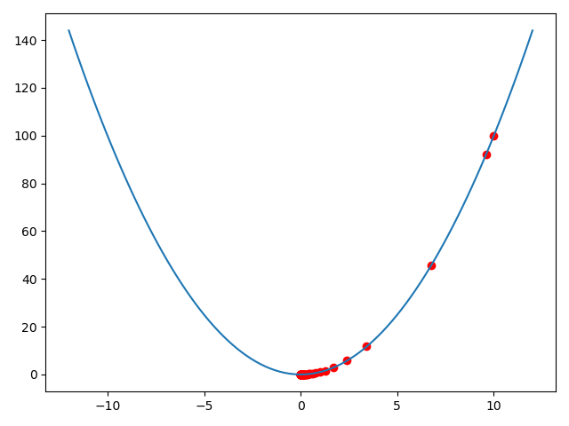

# Simple Gradient Descent

Equation: $y = x^2$



Now we initialize $x=10$ and we have to find optimal x value for $y = 0$, we know that the correct x value to get $y = 0$ is $x = 0$, now we are using Gradient Descent to get $x = 0$

**Python code:**

```python
#functions
y = lambda x: x**2
loss = lambda x, yt: (yt - y(x))**2
grad = lambda x, yt: (loss(x+0.000001, yt) - loss(x-0.000001, yt))/(2*0.000001)

# Variables
x = 10
yt = 0
lr = 0.0001

# loop
for i in range(1, 101):
    x -= lr*(i**3)*grad(x, yt)
    if i >= 95:
        print('Loss:',loss(x, yt))

# result
print('x:', x)
```

Output:

```python
$ python main.py 
Loss: 2.570621642795627e-17
Loss: 2.550075275651222e-17
Loss: 2.5297134639723663e-17
Loss: 2.5095343676931815e-17
Loss: 2.48953616690801e-17
Loss: 2.4697170616306883e-17
x: 7.049556579197655e-05
```

**Rust code:**

```rust
fn main() {
    // functions
    let y = |x:f32| x.powi(2);
    let loss = |x:f32, yt:f32| (yt - y(x)).powi(2);
    let grad = |x:f32, yt:f32| (loss(x+0.000001, yt) - loss(x-0.000001, yt))/(0.000002);
    let yt:f32 = 0.0;

    // Variables
    let mut x:f32 = 10.0;
    let lr = 0.0001;

    // loop
    for i in 1..101 {
        x -= lr*((i as f32).powi(3))*grad(x, yt);
        if i >= 95 {
            println!("Loss: {}", loss(x, yt));
        }
    }

    // result
    println!("x: {}", x);
}
```

Output:

```rust
$ cargo run
   Compiling rust v0.1.0 (/home/adhiban/Desktop/python/rust)
    Finished dev [unoptimized + debuginfo] target(s) in 0.69s
     Running `target/debug/rust`
Loss: 0.000000000000000025706318
Loss: 0.000000000000000025500853
Loss: 0.000000000000000025297231
Loss: 0.000000000000000025095445
Loss: 0.00000000000000002489546
Loss: 0.000000000000000024697262
x: 0.00007049563
```

