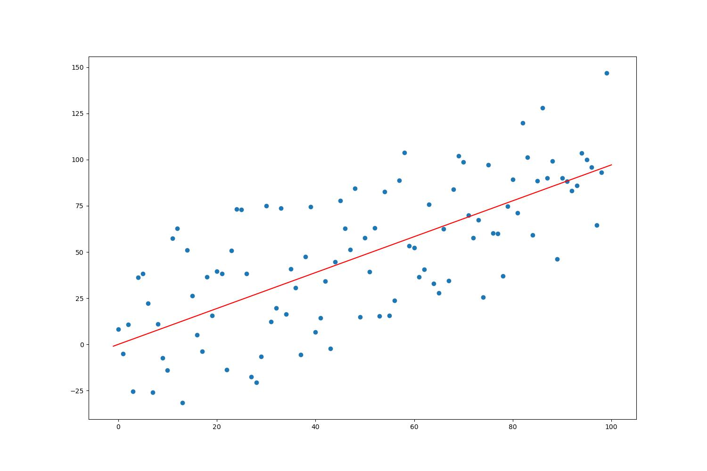

# Linear Regression in Python & Rust from Scratch

I have successfully implemented a linear regression algorithm from scratch using Python and Rust programming languages. The algorithm is built upon fundamental mathematical concepts and principles that are widely used in machine learning. 

To compile rust lib:
```
cargo build --release
```
Run Python:
```
python main.py
```
Output:


---

## Maths formula

### Line equation
$y = mx+c$

> here we have to find optimal value of $m$ and $c$

---

### Loss [MSE]

$loss = \frac{1}{N} \sum (y_{true} - y)^2 \dots$ Here $N$ is number of points

$loss = \frac{1}{N} \sum (y_{true} - mx -c)^2$

---

### Grad

$\displaystyle \triangle m = \frac{d}{dm} \left\{ \frac{1}{N} \sum (y_{true} - mx -c)^2 \right\}$

$\displaystyle = \frac{1}{N}\frac{d}{dm} \left\{  \sum (y_{true} - mx -c)^2 \right\}$

$\displaystyle = \frac{1}{N}  \sum \frac{d}{dm} (y_{true} - mx -c)^2$

$\displaystyle = \frac{1}{N}  \sum \left\{ (y_{true} - mx -c) \cdot \frac{d}{dm}(-mx) \right\}$

$\displaystyle = \frac{1}{N}  \sum \left\{ (y_{true} - mx -c) \cdot (-x) \right\}$

$\displaystyle \triangle m = -\frac{2}{N} \sum x(y_{true}-mx-c)$

---

$\displaystyle \triangle c = \frac{d}{dc} \left\{ \frac{1}{N} \sum (y_{true} - mx -c)^2 \right\}$

$\displaystyle = \frac{1}{N}\frac{d}{dc} \left\{  \sum (y_{true} - mx -c)^2 \right\}$

$\displaystyle = \frac{1}{N} \sum \frac{d}{dc} (y_{true} - mx -c)^2$

$\displaystyle = \frac{1}{N}  \sum \left\{ (y_{true} - mx -c) \cdot \frac{d}{dc}(-c) \right\}$

$\displaystyle = \frac{1}{N}  \sum \left\{ (y_{true} - mx -c) \cdot (-1) \right\}$

$\displaystyle \triangle c = -\frac{2}{N} \sum(y_{true}-mx-c)$

